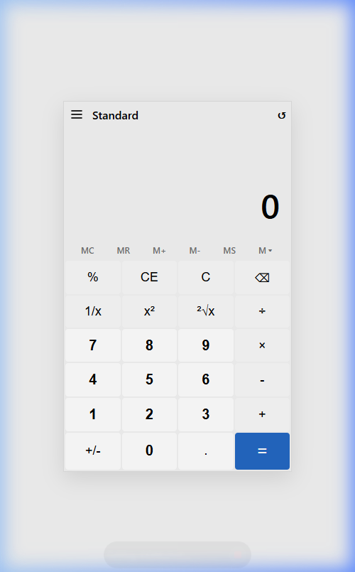

# 🧮 Zee Calculator (ذی کلکولیٹر)

**English:** Zee Calculator is a premium, professional-grade Android calculator application inspired by the modern Windows 10/11 Standard Calculator. It combines a sleek, intuitive UI with robust mathematical logic, making everyday calculations seamless and aesthetically pleasing.

**Urdu:** ذی کلکولیٹر ایک بہترین اور پروفیشنل اینڈرائیڈ ایپلی کیشن ہے جو کہ جدید ونڈوز 10/11 کے سٹینڈرڈ کلکولیٹر سے متاثر ہو کر بنائی گئی ہے۔ یہ ایپلی کیشن خوبصورت یوزر انٹرفیس (UI) اور طاقتور حسابی لاجک کا بہترین مجموعہ ہے، جو روزمرہ کے حساب کتاب کو آسان اور خوشگوار بناتی ہے۔

---

## 📸 Screenshots

  

---

## ✨ Features (خصوصیات)

- **Modern Design**: Clean and responsive UI built with Jetpack Compose.
- **Advanced Operations**: Includes Percentage (%), Reciprocal (1/x), Square (x²), and Square Root (√).
- **History Tracking**: Shows the previous expression clearly above the result.
- **Full Memory Support**: MC, MR, M+, M-, MS functionality.
- **Error Handling**: Graceful handling of division by zero and invalid inputs.
- **English & Urdu Documentation**: Comprehensive guides included for developers.

---

## 🛠 Tech Stack (ٹیکنالوجی)

- **IDE**: Android Studio
- **Language**: Kotlin
- **UI Framework**: Jetpack Compose (Modern native UI toolkit)
- **Theme**: Material Design 3

---

## 🚀 How to Build & Run (استعمال کرنے کا طریقہ)

1. Clone the repository.
2. Open the project in **Android Studio**.
3. Build and Run on an emulator or physical device.

For a detailed guide on generating an APK file, please refer to [APK_GUIDE.md](./APK_GUIDE.md).

---

## 👨‍💻 Developer Information (ڈویلپر کی معلومات)

- **Name**: Zeeshan Sarwar (ذیشان سرور)
- **Email**: [Add your email if desired]
- **Mobile**: 00923336003596
- **GitHub**: [zeeshansarwar1986](https://github.com/zeeshansarwar1986)

---

## 📄 License
This project is licensed under the MIT License - see the LICENSE file for details.

---
*Developed with ❤️ for the community.*
